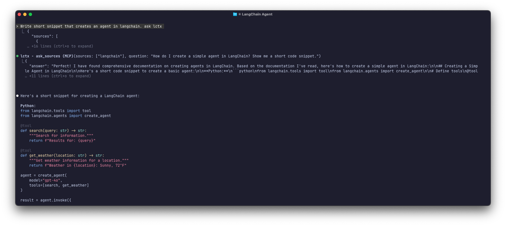

<p align="center">
  <pre align="center">
  ╦  ╔═╗╔╦╗═╗ ╦
  ║  ║   ║ ╔╩╦╝
  ╩═╝╚═╝ ╩ ╩ ╚═
  </pre>
</p>

<p align="center">
  <strong>Local context aggregator for AI coding agents.</strong><br>
  Your repos, your docs, your machine.
</p>

<p align="center">
  <a href="./LICENSE"></a>
  <a href="https://bun.sh"></a>
</p>

<p align="center">
  <a href="docs/assets/lctx_list_usage.png"></a>
  <a href="docs/assets/claude_code_mcp_usage.png"></a>
</p>

---

## What is lctx?

**lctx** manages local context sources (git repositories, documentation, files) and spawns isolated subagents to query them. It works as a CLI tool or as an MCP server for AI coding assistants like Claude Code, Cursor, and Gemini CLI.

Instead of relying on remote context providers with opaque sources and unpredictable indexing, lctx gives you full control over what your AI agent can access.

## Why lctx?

Tools like Context7 and Exa are excellent for quickly retrieving documentation. However, certain use cases need more control than remote providers offer.

### Gaps in Remote Context Providers

| Issue                  | Problem                                                                                  |
|------------------------|------------------------------------------------------------------------------------------|
| **Opaque sources**     | You don't know which exact document or version a response came from                      |
| **No version pinning** | Remote providers serve their latest indexed content—no way to request a specific version |
| **No private access**  | Internal libraries, private packages, and proprietary docs are unreachable               |

### The lctx Approach

- **Local sources** — Clone repositories, docs, and notes to your machine. You control exactly what your agent can access.
- **Version pinning** — Specify any tag, branch, or commit.
- **Private repos** — Works with your existing Git credentials.

### Comparison

| Capability           | Context7 / Exa | lctx                  |
|----------------------|----------------|-----------------------|
| Source transparency  | Opaque         | Explicit local paths  |
| Version pinning      | Latest only    | Any tag/branch/commit |
| Private repositories | No access      | Full access           |
| Context refinement   | Raw chunks     | Sub-agent filtering   |

## How It Works

```
┌─────────────────────────────────────────────────────────────────┐
│  Main Agent (Claude Code / Cursor / etc.)                       │
│                          │                                      │
│                          ▼                                      │
│                    lctx MCP Server                              │
│                          │                                      │
│         ┌────────────────┴────────────────┐                     │
│         ▼                                 ▼                     │
│   list_sources                      ask_sources                 │
│   (returns list)                    (spawns subagent)           │
│                                           │                     │
│                                           ▼                     │
│                              ┌─────────────────────┐            │
│                              │ Isolated Temp Dir   │            │
│                              │ /tmp/lctx-{uuid}/   │            │
│                              │ ├── prompt.md       │            │
│                              │ ├── .mcp.json = {}  │ ◄── No MCP │
│                              │ ├── langchain/ ─────┼──► symlink │
│                              │ └── bun-docs/  ─────┼──► symlink │
│                              └─────────────────────┘            │
│                                           │                     │
│                                           ▼                     │
│                              Subagent reads files directly      │
│                              Returns answer to main agent       │
└─────────────────────────────────────────────────────────────────┘
```

**Key design**: Subagents run in isolated temp directories with empty MCP configs to prevent circular loops. Sources are available via symlinks—subagents read files directly.

For internal module structure and component details, see [Architecture](docs/architecture.md).

## Getting Started

### Prerequisites

- [Bun](https://bun.sh) 1.0 or higher

### Install Locally

```bash
git clone https://github.com/anthropics/lctx.git
cd lctx
bun install && bun link
```

### Add to Claude Code (MCP)

```bash
claude mcp add --transport stdio lctx -- bunx lctx mcp
```

This registers lctx as an MCP server. Claude Code will have access to `list_sources` and `ask_sources` tools.

## Usage

### Add Sources

Add documentation (llms.txt or similar):

```bash
lctx add bun https://bun.sh/llms-full.txt -t docs -d "bun.sh full documentation"
```

Add a git repository:

```bash
lctx add langchain https://github.com/langchain-ai/docs.git -d "LangChain, LangGraph, and integrations docs"
```

Add with specific branch:

```bash
lctx add react https://github.com/facebook/react -b v17.0.2
```

### Query Sources

**From Claude Code (main session):**

Just ask naturally and mention lctx:

```
How to write an agent in LangGraph? ask lctx
```

Claude will use the `ask_sources` MCP tool to spawn a subagent with access to your configured sources.

**Direct CLI query:**

```bash
lctx ask -s bun -q "How to resolve version from package.json?"
```

**Interactive chat session:**

```bash
lctx chat -s langchain bun
```

Opens an interactive agent session with symlinked access to the specified sources.

### List Sources

```bash
lctx list
```

## Command Reference

| Command                               | Description                                             |
|---------------------------------------|---------------------------------------------------------|
| `lctx add <name> <url>`               | Add a source (git repo, docs URL, file, or directory)   |
| `lctx add <name> <url> -t <type>`     | Specify source type: `git`, `docs`, `file`, `directory` |
| `lctx add <name> <url> -b <branch>`   | Clone specific branch/tag (git sources)                 |
| `lctx add <name> <url> -d <desc>`     | Add description for the source                          |
| `lctx remove <name>`                  | Remove a source                                         |
| `lctx update [name]`                  | Update one source or all sources                        |
| `lctx list`                           | List all configured sources                             |
| `lctx ask -s <sources> -q <question>` | Query sources in headless mode                          |
| `lctx chat -s <sources>`              | Start interactive session with sources                  |
| `lctx mcp`                            | Start MCP server (stdio transport)                      |

## Source Types

| Type        | Description                                      | Example                        |
|-------------|--------------------------------------------------|--------------------------------|
| `git`       | Git repository (cloned locally)                  | `https://github.com/org/repo`  |
| `docs`      | Documentation URL (llms.txt, etc.)               | `https://bun.sh/llms-full.txt` |
| `file`      | Single local file (/path/private-notes.md, etc.) | `/path/to/file.md`             |
| `directory` | Local directory (/path/private project, etc.)    | `/path/to/docs/`               |

## Configuration

lctx stores its configuration at `~/.config/lctx/config.json`. This file is created automatically on first run.

### Config Structure

| Field              | Description                                                         |
|--------------------|---------------------------------------------------------------------|
| `sourcesDirectory` | Where sources are cloned/stored (default: `~/.config/lctx/sources`) |
| `sources`          | Array of configured sources                                         |
| `agents`           | Agent command templates (keyed by agent name)                       |
| `defaultAgent`     | Which agent to use by default                                       |

### Agent Configuration

Each agent requires a command template that lctx uses to spawn subagents:

```json
{
  "claude-code": {
    "commands": {
      "chat": "claude",
      "ask": "claude --strict-mcp-config --mcp-config {mcp_config_file} -p {prompt_file}"
    },
    "addDirFlag": "--add-dir {path}",
    "mcp": {
      "path": ".mcp.json",
      "config": { "mcpServers": {} }
    }
  }
}
```

### Command Placeholders

| Placeholder         | Replaced With                                 | Used In                         |
|---------------------|-----------------------------------------------|---------------------------------|
| `{prompt_file}`     | Path to autogenerated `prompt.md` in temp dir | `commands.ask`                  |
| `{mcp_config_file}` | Path to MCP config file in temp dir           | `commands.ask`                  |
| `{working_dir}`     | Temp directory path                           | `commands.ask`, `commands.chat` |
| `{path}`            | Resolved source path                          | `addDirFlag`                    |

### How addDirFlag Works

The `addDirFlag` template is applied **for each source** requested. For example, with sources `langchain` and `bun`:

```
addDirFlag: "--add-dir {path}"
```

Becomes:
- `--add-dir ~/.config/lctx/sources/langchain`
- `--add-dir ~/.config/lctx/sources/bun`

These arguments are appended to the base command.

### Command Construction Example

Given: `lctx ask -s langchain bun -q "How to create an agent?"`

**Base command** (after placeholder interpolation):
```
claude --strict-mcp-config --mcp-config /tmp/lctx-uuid/.mcp.json -p /tmp/lctx-uuid/prompt.md
```

**Final command** (with addDirFlag for each source):
```
claude --strict-mcp-config --mcp-config /tmp/lctx-uuid/.mcp.json -p /tmp/lctx-uuid/prompt.md --add-dir ~/.config/lctx/sources/git/langchain --add-dir ~/.config/lctx/sources/docs/bun/content.txt
```

### MCP Config (mcp field)

Defines the MCP configuration file written to the subagent's temp directory. This controls which MCP servers the subagent can access.

| Field    | Description                                                                                                                                                  |
|----------|--------------------------------------------------------------------------------------------------------------------------------------------------------------|
| `path`   | Where to write the MCP config (relative to temp dir). Different agents use different paths: `.mcp.json` for Claude Code, `.cursor/mcp.json` for Cursor, etc. |
| `config` | The MCP configuration content. Usually empty (`{ "mcpServers": {} }`) to block all MCP tools.                                                                |

**Why this matters:** Each CLI agent has its own MCP config location and format. By making this configurable, lctx works with any agent.

**Critical:** Never include `lctx` in the subagent's MCP config—this creates a circular dependency where the subagent calls lctx, which spawns another subagent, infinitely.

## Supported CLI Agents

lctx requires a CLI agent to be installed on your system. The agent is spawned as a subagent to query your sources.

| Agent           | Status                                         |
|-----------------|------------------------------------------------|
| **Claude Code** | Tested and supported in default configuration  |
| Cursor CLI      | Not tested — configure in `config.json`        |
| OpenAI Codex    | Not tested — configure in `config.json`        |
| Gemini CLI      | Not tested — configure in `config.json`        |
| Droid           | Not tested — configure in `config.json`        |
| OpenCode        | Not tested — configure in `config.json`        |

To use a different agent, add its configuration to the `agents` object in `~/.config/lctx/config.json` and set `defaultAgent` to its name.

## When to Use lctx

- You need documentation for a **specific library version**, not just "latest"
- Your project depends on **private or internal packages**
- You require **deterministic, auditable** context retrieval
- You want to **combine multiple sources** (repos + docs + notes) in a single query
- Data privacy or compliance requirements **prevent using remote context providers**

## License

MIT
